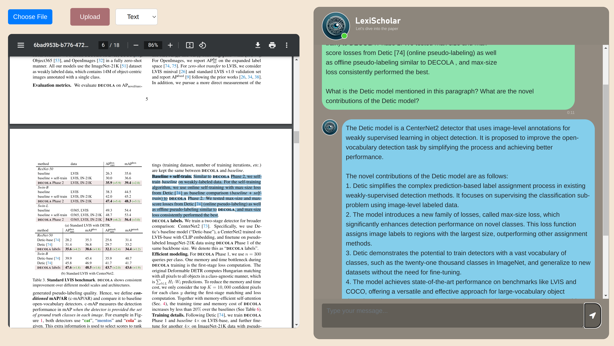

<h1 align="center">LexiScholar</h1>

<p align="center">
  
  <br>A Paper-Reading Assistant powered by LLMs
</p>

<p style="text-align:justify;"><strong>LexiScholar</strong> is a cutting-edge paper-reading assistant leveraging Large Language Models (LLMs), enhanced by Retrieval-Augmented Generation (RAG) and our innovative Generation-Augmented Generation (GAG) techniques. It boasts advanced reference management capabilities to streamline the comprehension of complex academic literature, along with an optional math-fine-tuned model for superior explanations of mathematical content.</p>


## Table of contents

* [Key Features](#key-features)
* [Screenshot](#screenshot)
* [Setup](#setup)
  * [Python](#python)
  * [Anystyle](#anystyle)
  * [API Keys](#api-keys)
* [Usage](#usage)
* [Directory Structure](#directory-structure)
* [Author](#author)

### Key Features

- **Document Parsing:** Efficiently parse documents using PyMuPDF.
- **Reference Extraction:** Extract references seamlessly with Anystyle NER and the Semantic Scholar API.
- **Advanced Generation:** Utilize LlamaIndex for RAG and Cohere command-r along with math fine-tuned Llama2 for superior text generation.
- **User-Friendly Interface:** Simple Flask server and intuitive chat UI for smooth interaction.

</br>



## Setup

### Python

Install the required python packages using the following command:

```bash
pip install -r requirements.txt
```
<p align="right"><a href="#readme-top">⬆︎ BACK TO TOP</a></p>

### Anystyle

[Anystyle](https://github.com/inukshuk/anystyle) is a tool for extracting bibliographic data from unstructured text. We use a Docker image to run a simple Ruby server, which is available in `src/server/anystyle/Dockerfile`. Specify the URL where the server is running in the appropriate modules.
<p align="right"><a href="#readme-top">⬆︎ BACK TO TOP</a></p>


### API Keys

To use LexiScholar, you need to provide your API keys for Semantic Scholar, Hugging Face, and Cohere. Set the following environment variables to the respective keys:

* `SEMANTIC_SCHOLAR_API_KEY`
* `HUGGINGFACE_API_KEY`
* `COHERE_API_KEY`
<p align="right"><a href="#readme-top">⬆︎ BACK TO TOP</a></p>


## Usage

To use the chat app just run the `run.sh` script from the project root.

```
./run.sh
```
<p align="right"><a href="#readme-top">⬆︎ BACK TO TOP</a></p>

### Directory  Structure

| **Directory**  | **Description**                                                           |
|----------------|---------------------------------------------------------------------------|
| experiments    | Code containing experimental features and tests                           |
| src/rag        | Modules for Retrieval-Augmented Generation (RAG) to be used with the chat |
| src/refextract | Modules for extracting references and downloading metadata                |
| src/server     | UI and backend code for the chat application                              |
| src/anystyle   | Simple Ruby server for Anystyle library                            |
<p align="right"><a href="#readme-top">⬆︎ BACK TO TOP</a></p>


## Author

* GitHub - [Aayan](https://github.com/Aayan107)
* LinkedIn - [@Aayan107](https://www.linkedin.com/in/aayan107/)

<p align="right"><a href="#readme-top">⬆︎ BACK TO TOP</a></p>
